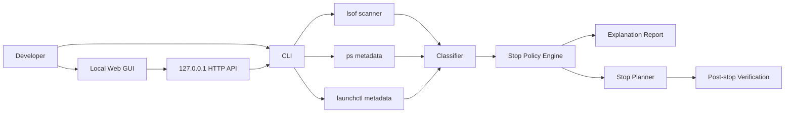

# Local Port Guard

Local Port Guard is a safe macOS local port and launchd service guardrail for developers who run long-lived dashboards, agents, tunnels, browser automation, and local APIs.

It is not a raw port killer. It scans listening ports, classifies the owning process, explains why it may be running, checks whether launchd is involved, protects important ports, and only stops explicitly selected services after confirmation.

## Why This Exists

Many developer machines have become always-on local servers:

- local dashboards
- API sidecars
- AI agents
- browser automation profiles
- mobile debugging servers
- signing/certificate bridges
- background sync jobs
- launchd-managed services

Generic port tools answer one question: "Which process owns this port?"

Local Port Guard answers the operational question: "Can I safely stop this, and what will happen if I do?"

## Core Advantages

### Explain Before Stop

Each listener is classified before any stop action is offered. The report explains:

- port
- PID and parent PID
- process command
- CPU and memory usage when available
- launchd label when detected
- likely purpose
- stop policy
- expected stop strategy

### Protected Ports

Important services can be protected. In the current prototype, these are hard-protected:

- `3012`: example protected local dashboard
- `8012`: example protected local API

Protected ports are visible in the UI, but stop actions are blocked.

### Prototype Scope and Configurability

The current prototype intentionally keeps the protection rules in source code. This makes the first safety model easy to inspect: protected ports are enforced by the CLI policy layer, not only hidden in the GUI.

This is also the main current limitation. Users who want to protect their own ports must edit the rules in `local_port_guard.py` until the configurable rules file is implemented.

The next planned milestone is a user-owned rules file such as:

```json
{
  "protected_ports": [3012, 8012, 5432],
  "port_rules": {
    "5432": {
      "category": "protected",
      "name": "Local PostgreSQL",
      "stop_policy": "blocked"
    }
  },
  "command_rules": [
    {
      "pattern": "Chrome.*--remote-debugging-port",
      "category": "browser-tooling",
      "name": "Chrome remote debugging",
      "stop_policy": "confirm"
    }
  ]
}
```

The product direction is therefore:

```text
safe prototype
  -> configurable local rules
  -> GUI protection editor
  -> audit log
```

### launchd-Aware Stopping

On macOS, killing a child process is often the wrong operation. If a service is managed by launchd, the child process may restart immediately.

Local Port Guard checks for launchd labels and prefers launchd lifecycle operations before falling back to `kill -TERM`.

### Local-Only Design

The GUI binds to `127.0.0.1` only. No cloud service is required. No telemetry is sent.

### Defensive Defaults

The CLI is read-only by default. Stop actions require an explicit command. The GUI shows details and confirmation before executing a stop request.

## Current Prototype

This repository currently contains a minimal Python implementation:

- `local_port_guard.py`: CLI scanner and guarded stop planner.
- `local_port_guard_gui.py`: local web GUI backed by the CLI.
- `local-port-lifecycle-guard/SKILL.md`: Codex skill draft for AI-assisted local port operations.

The prototype intentionally avoids external dependencies.

## Quick Start

Scan local listening TCP ports:

```bash
python3 local_port_guard.py scan
```

Output JSON:

```bash
python3 local_port_guard.py scan --json
```

Show a dry-run stop plan:

```bash
python3 local_port_guard.py stop --port 9222
```

Execute the stop plan:

```bash
python3 local_port_guard.py stop --port 9222 --execute
```

Start the local GUI:

```bash
python3 local_port_guard_gui.py
```

Open:

```text
http://127.0.0.1:8765
```

## Categories

| Category | Meaning | Default Policy |
|---|---|---|
| `protected` | Business-critical local service | Block stop |
| `development` | Local development server | Confirm before stop |
| `signing` | Certificate or government signing bridge | Confirm before stop |
| `browser-tooling` | Browser automation or debug endpoint | Confirm before stop |
| `mobile-dev` | Android or mobile development service | Confirm before stop |
| `system` | macOS system service | Read-only |
| `user-app` | User-facing desktop app | Report-only |
| `guard-tool` | Local Port Guard itself | Report-only |
| `unknown` | No rule matched | Report-only |

## Stop Policies

| Policy | Behavior |
|---|---|
| `blocked` | Stop is refused |
| `readonly` | Explanation only, no stop action |
| `report-only` | Visible in reports, no stop action |
| `confirm` | Stop plan is available and requires explicit execution |

## Safety Model

Local Port Guard uses a conservative safety model:

1. Scan first.
2. Classify before action.
3. Explain before stop.
4. Refuse protected and system services.
5. Prefer launchd lifecycle operations for launchd-backed services.
6. Use `kill -TERM` only as a fallback.
7. Rescan after stopping.

See [docs/SECURITY_MODEL.md](docs/SECURITY_MODEL.md) for details.

## Architecture

The current implementation is intentionally small:



See [docs/ARCHITECTURE.md](docs/ARCHITECTURE.md) for the full design.

For the open-source engineering plan and framework diagram, see:

- [docs/FRAMEWORK.md](docs/FRAMEWORK.md)
- [docs/ENGINEERING.md](docs/ENGINEERING.md)

## Open Source Positioning

There are already good tools for listing or killing ports. Local Port Guard is different because it focuses on local service governance:

- port-first workflow
- launchd awareness
- protected allowlist
- explain-before-stop
- conservative stop policy
- local-only operation
- AI-assisted operations readiness

See [docs/OPEN_SOURCE_POSITIONING.md](docs/OPEN_SOURCE_POSITIONING.md).

## Roadmap

The next milestones are:

1. Configurable rules file.
2. Persistent audit log.
3. Rich launchd detail view.
4. Test suite for protected ports and stop planning.
5. GUI protection editor.
6. Homebrew-friendly package layout.

See [docs/ROADMAP.md](docs/ROADMAP.md).

## Non-Goals

Local Port Guard is not intended to be:

- a full system monitoring suite
- a cloud observability platform
- an automatic process killer
- a replacement for launchd managers
- a Linux eBPF diagnostic agent

## License

MIT. See [LICENSE](LICENSE).
