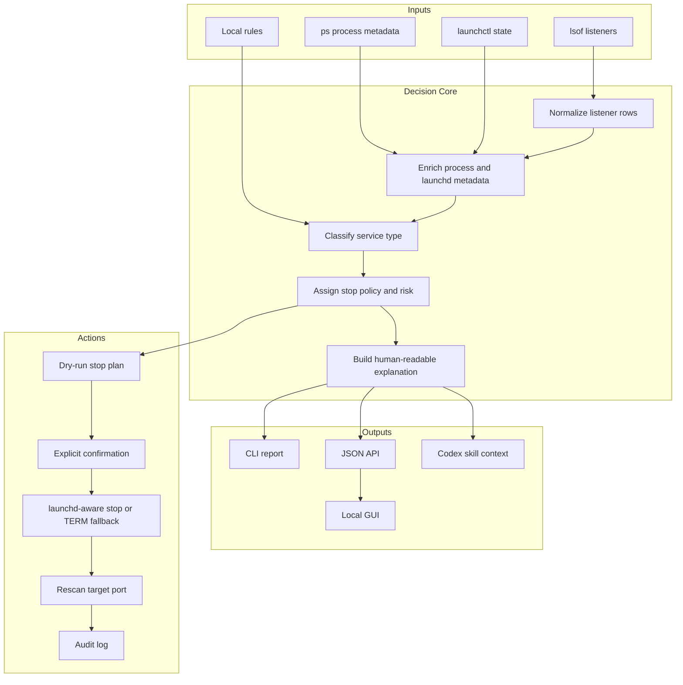
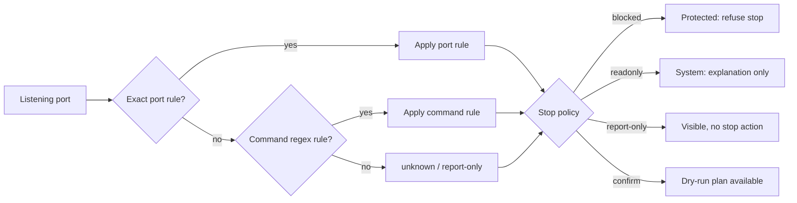
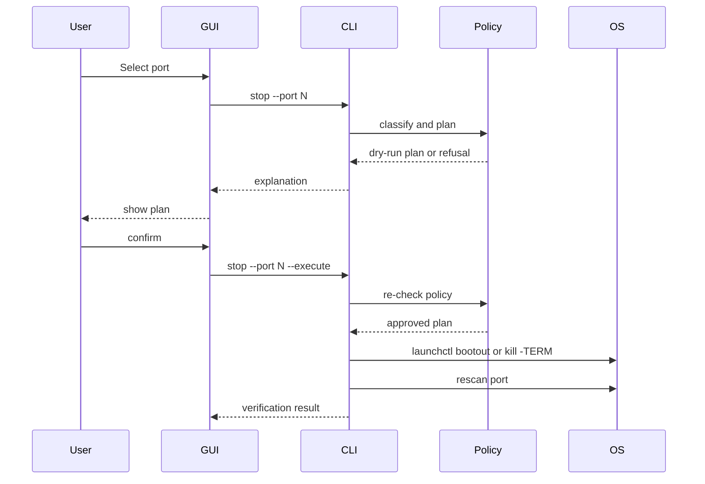

# Framework

This document describes the product framework for Local Port Guard.

## Product Goal

Local Port Guard helps developers decide whether a listening local port is safe to stop.

The tool is intentionally not a one-click port killer. It is a local service guardrail with classification, explanation, protection, launchd awareness, and post-action verification.

## System Framework



## Classification Framework



## Stop Framework



## Policy Matrix

| Category | Examples | Policy | Stop Strategy |
|---|---|---|---|
| `protected` | business-critical local API or dashboard | `blocked` | Refuse |
| `development` | Next.js, Vite, Rails, Django dev server | `confirm` | launchd if managed, else TERM |
| `signing` | HiPKI, TIPO ServiSign | `confirm` | launchd if managed, else TERM |
| `browser-tooling` | Chrome DevTools remote debugging | `confirm` | TERM specific debug profile |
| `mobile-dev` | ADB server | `confirm` | Prefer native stop command |
| `system` | ControlCenter, rapportd | `readonly` | No stop |
| `user-app` | LINE, Slack, Discord | `report-only` | No stop by default |
| `guard-tool` | Local Port Guard GUI | `report-only` | No stop by default |
| `unknown` | unmatched listener | `report-only` | No stop |

## Recommended Repository Shape

```text
local-port-guard/
  README.md
  LICENSE
  local_port_guard.py
  local_port_guard_gui.py
  docs/
    ARCHITECTURE.md
    ENGINEERING.md
    FRAMEWORK.md
    OPEN_SOURCE_POSITIONING.md
    ROADMAP.md
    SECURITY_MODEL.md
    TEST_PLAN.md
  codex-skill/
    SKILL.md
```

## Future Package Shape

When the prototype grows, split the code into modules:

```text
local_port_guard/
  __init__.py
  cli.py
  scanner.py
  metadata.py
  classifier.py
  policy.py
  stop_planner.py
  launchd.py
  audit.py
  config.py
  server.py
  static/
tests/
```

The current single-file prototype is intentional. It keeps the first open-source version easy to inspect.
